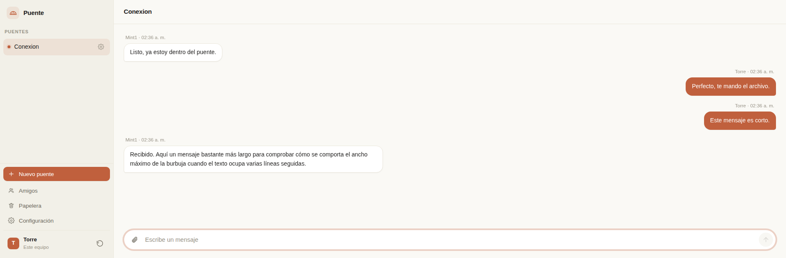
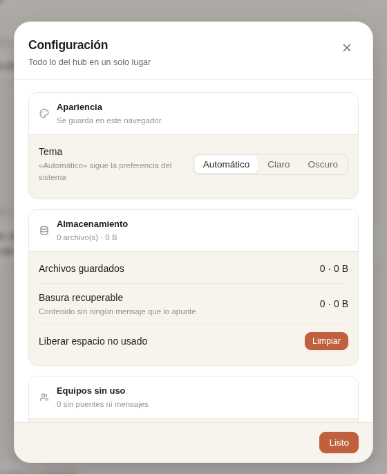

# Puente

Comparte texto y archivos entre los equipos de tu red local desde el navegador, sin instalar nada en los clientes y sin volver a configurar permisos cada vez que formateas.

Un **hub** (FastAPI + SQLite) corre en una máquina encendida. El resto de los equipos —notebook, VM, celular— entran a una URL local y comparten en un chat organizado por *puentes*: salas independientes con sus propios miembros.



Todo el estado del servicio cabe en una carpeta: copias `data/` y el hub se mudó de máquina. La única excepción es la regla de firewall, y hay un módulo que la crea y la quita.

**Qué no es:** no es respaldo (el contenido está pensado para caducar), no es sincronización de carpetas (no hay espejo ni resolución de conflictos), no es acceso remoto (el alcance es la LAN) y no mueve archivos enormes (hay un límite configurable; para 50 GB un disco externo siempre será mejor).

---

## Requisitos

- Python 3.10 o superior.
- Windows, Linux o macOS para el hub. Los clientes solo necesitan un navegador.
- Todos los equipos en la misma red local.

## Instalación

```bash
git clone https://github.com/milenkomilic/puente-lan.git
cd Bridge

python -m venv .venv
```

Activa el entorno virtual:

```powershell
.venv\Scripts\activate
```

```bash
source .venv/bin/activate
```

E instala las dependencias:

```bash
pip install -r requirements.txt
```

## Levantar el hub

```bash
python run.py
```

Lee el host y el puerto desde `data/config.json`, que se crea solo con los valores por defecto en el primer arranque, igual que la base de datos y las carpetas. Cuando arranque vas a ver la URL en la consola; déjala abierta mientras uses el servicio.

Para desarrollo también sirve el comando equivalente, con host y puerto fijos en vez de leídos de la configuración:

```bash
uvicorn app.main:app --host 0.0.0.0 --port 8080
```

`--host 0.0.0.0` **no es opcional**. El valor por defecto de casi todos los frameworks es `127.0.0.1`, que funciona perfecto en la máquina local y es completamente invisible desde cualquier otra: es la causa número uno de "no me conecta".

## Entrar desde otro equipo

Averigua la IP del hub (`ipconfig` en Windows, `ip addr` en Linux) y abre `http://IP-DEL-HUB:8080` desde el navegador de cualquier equipo de la red. La primera vez te pide un nombre para identificarlo.

Si no conecta, mira [Resolución de problemas](#resolución-de-problemas).

### Entrar por nombre en vez de IP

Para escribir `http://puente:8080` en lugar de la IP, entra a **Configuración → Acceso por nombre** y descarga el script del sistema operativo de ese equipo: `.bat` en Windows (clic derecho → Ejecutar como administrador) o `.sh` en Linux y macOS (`sh agregar-puente.sh`, pide tu contraseña). El botón **Comprobar** te dice si quedó funcionando.

Hay que hacerlo **una vez en cada equipo** que quiera usar el nombre. Un sitio web no puede editar el archivo `hosts` de la máquina que lo visita, así que no existe forma de aplicarlo de forma remota; el detalle está en el ADR-15 del [diseño técnico](docs/puente-diseno-tecnico.md).

> Si entras por IP, conviene configurar el nombre **antes** de crear el equipo. Para el navegador, `192.168.0.7` y `puente` son orígenes distintos: si lo haces después, vas a tener que crear el equipo de nuevo.

---

## Uso

**Crear un puente** con el botón de la barra lateral. Quien lo crea queda como dueño.

**Invitar a alguien que todavía no tiene cuenta**: engranaje del puente → **Invitar a alguien nuevo**. Genera un enlace de un solo uso con su QR, que vence en 15 minutos; se abre en el equipo nuevo o se escanea desde el celular, y queda dentro del puente.

**Agregar a un amigo**: engranaje del puente → **Agregar equipo**. Solo aparecen tus amigos aceptados, así que agregar a alguien nunca expone el resto de los equipos del servicio.

**Hacer amigos**: botón **Amigos** de la barra lateral. Genera un enlace de un solo uso que vence en 7 días; lo compartes por fuera de Puente y quien lo abre ve quién invita y decide aceptar o rechazar. Una solicitud sin responder se vence sola a los 7 días.

**Enviar**: texto con Enter, archivos arrastrándolos a la ventana, pegando con `Ctrl+V` o con el botón del clip.

**Administrar el puente**: desde el mismo engranaje, expulsar, transferir la propiedad, renombrar o mover a la papelera (recuperable 7 días).

**Recuperar la sesión de un equipo** —por ejemplo tras limpiar la caché del navegador— con el botón **⟲** junto a tu nombre, abajo en la barra lateral. Genera un enlace de un solo uso para abrir en el navegador donde perdiste el acceso; al canjearlo, la sesión anterior deja de valer.

**Configuración**: uso de disco, liberar espacio, equipos sin uso, regla de firewall, acceso por nombre y tema claro/oscuro, todo en la misma ventana.



---

## Configuración

Vive en `data/config.json`, que se crea solo con estos valores en el primer arranque. Se lee una sola vez al arrancar: **para que un cambio surta efecto hay que reiniciar el hub**.

| Clave | Descripción | Por defecto |
|---|---|---|
| `host` | Interfaz donde escucha el hub. `0.0.0.0` significa "todas"; no lo cambies a `127.0.0.1` o dejará de verse desde la red. | `"0.0.0.0"` |
| `port` | Puerto del hub. | `8080` |
| `max_file_mb` | Tamaño máximo por archivo, validado en el cliente y en el servidor. | `100` |
| `max_actors_per_bridge` | Equipos que caben en un puente. | `5` |
| `max_actors_total` | Tope de equipos registrados en todo el servicio. Distinto del anterior: puede haber varios puentes de 5. | `40` |
| `trash_days` | Días que un puente eliminado se puede restaurar desde la papelera. | `7` |
| `retention_days` | Días que vive un mensaje sin pin. Los campos existen; el barrido automático todavía no. | `7` |
| `hostname` | Nombre amigable para el acceso por nombre. | `"puente"` |

Los vencimientos de los enlaces (15 minutos para invitación y recuperación, 7 días para amistad) están fijos en el código, no en este archivo.

---

## Resolución de problemas

**Conecto desde el hub pero no desde otro equipo.** Casi siempre es el binding: verifica que `host` sea `0.0.0.0` y no `127.0.0.1`.

**En Windows conecta desde el hub pero no desde la red.** Son dos problemas distintos que se confunden:

1. *Falta la regla de firewall.* La ventana de Configuración la aplica, o a mano:

   ```
   netsh advfirewall firewall add rule name="Puente" dir=in action=allow protocol=TCP localport=8080 profile=private
   ```

2. *La red está clasificada como Pública.* Windows bloquea la conexión aunque la regla exista. Revísalo y cámbialo a `Private`:

   ```powershell
   Get-NetConnectionProfile | Select-Object Name, InterfaceAlias, NetworkCategory
   ```

**En Linux** lo más probable es que no haya nada que hacer: en Ubuntu de escritorio `ufw` viene inactivo y el puerto ya está abierto. Compruébalo con `sudo ufw status`; si dice `inactive`, terminaste. No actives el firewall solo para abrirle un hueco: quedarías con una protección que antes no tenías y que nadie pidió.

**Una VM no conecta.** Con el adaptador en NAT el tráfico sale con la IP del anfitrión. Cámbialo a modo puente (*bridged*).

**Perdí la sesión de un equipo.** Desde cualquier navegador donde sigas con sesión, usa el botón **⟲** junto a tu nombre para generar un enlace de recuperación y ábrelo donde la perdiste. Vence en 15 minutos.

**Quiero volver a probar todo desde cero.** `python reset_fabrica.py` (ver [Desarrollo](#reset-de-fábrica)).

---

## Seguridad

Sé consciente de dónde está parado el proyecto: **no hay HTTPS, así que el token de sesión viaja en claro**. Es aceptable en una red propia; no lo es en una ajena.

Lo que sí está resuelto:

- Un actor solo ve los puentes de los que es miembro, y el WebSocket verifica la membresía al conectar, no solo el token.
- Conocer el hash de un archivo no basta para descargarlo: hay que ser miembro de algún puente donde ese blob aparezca.
- El token se genera con un CSPRNG y la cookie es `HttpOnly`. El contenido de los mensajes se renderiza con `textContent`, nunca concatenado en HTML.
- Los enlaces de invitación, recuperación y amistad son de un solo uso y con vencimiento; canjearlos los invalida de inmediato. Recuperar un equipo **rota su token de sesión**, así que si alguien interceptó el enlace el equipo legítimo lo nota en el momento en vez de compartir la sesión en silencio.

Límites conocidos y aceptados:

- **Quien controla el hub tiene poder absoluto**: tiene el disco y puede leer los blobs sin pasar por la aplicación. El rol de dueño es una herramienta de gestión, no una barrera frente al dueño del hardware.
- **Revocar detiene el acceso futuro, no el pasado.** Lo ya descargado no se recupera.
- **El WebSocket comprueba el permiso solo al abrir.** Un expulsado con la pestaña abierta sigue recibiendo hasta que recargue.

El modelo completo está en el [diseño técnico](docs/puente-diseno-tecnico.md).

---

## Desarrollo

### Estructura

```
Bridge/
├── app/
│   ├── main.py            arranque, routers, estáticos, CORS
│   ├── config.py          lee y crea data/config.json
│   ├── db.py              conexión SQLite, PRAGMAs, migraciones
│   ├── hostentry.py       acceso por nombre (ADR-15)
│   ├── firewall.py        detección y aplicación multiplataforma
│   ├── gc.py              recolección de blobs huérfanos
│   ├── routes/            un módulo por área de la API
│   └── static/index.html  interfaz completa: vanilla JS, sin build step
├── docs/                  diseño técnico, esquema, migraciones, roadmap
├── data/                  estado portátil, generado en runtime (fuera de Git)
├── run.py                 punto de entrada
├── test.py                suite end-to-end
├── tools.py               inspección rápida de la base
└── reset_fabrica.py       borra data/ con varios seguros
```

El modelo de datos es la pieza central del diseño:

```
Actor    →  equipo identificado (nombre + cookie de sesión)
   ↓
Puente   →  hasta 5 actores, chat propio, un dueño
   ↓
Mensaje  →  referencia; vive dentro de un puente, con su pin y vencimiento
   ↓
Blob     →  contenido físico, global, direccionado por SHA-256, deduplicado
```

Separar el **mensaje** (referencia, con sus permisos) del **blob** (contenido, compartido entre puentes) da tres propiedades sin código extra: enviar el mismo archivo dos veces ocupa espacio una sola vez, el hash verifica integridad, y un blob nunca se borra mientras exista un mensaje vivo que lo apunte aunque esté en otro puente.

### Pruebas

```bash
pip install requests
python test.py
```

Con el servidor corriendo en otra consola. Son 55 comprobaciones contra el servidor real, en poco más de un segundo: aislamiento entre actores, tope de equipos por puente, paginación por cursor, deduplicado, que un no miembro no descargue aunque conozca el hash, papelera con restauración, transferencia, expulsión con aviso, y que el purgado libere los blobs en disco. Crea sus datos con prefijo `_test_` y limpia al terminar, así que no toca los tuyos.

Córrela antes de cada commit. Es la forma barata de saber que un cambio no rompió algo que ya funcionaba.

### Inspeccionar la base

```bash
python tools.py
```

Lista actores con sus ids, puentes y membresías. Útil cuando necesitas un id a mano.

### Reset de fábrica

```bash
python reset_fabrica.py            # solo muestra qué hay, no toca nada
python reset_fabrica.py --force    # borra data/ de verdad
```

Por defecto es una simulación. Con `--force` pide escribir una frase de confirmación, copia `data/` completa a `data_backup_<fecha>/` (salvo `--no-backup`) y se niega a correr si detecta el hub respondiendo en el puerto configurado. Al terminar deja `data/bridge.db` recreada con el esquema al día, sin reiniciar el servidor.

### Cambios de esquema

Las migraciones son secuenciales y se aplican solas al arrancar, gateadas por `PRAGMA user_version`. Para agregar una: crea `docs/migracion-00N.sql` y añade el `if v < N` correspondiente en `db.py`. No edites tablas a mano.

### Nota de mantenimiento

Cuando un cambio contradiga una decisión registrada, **edita el ADR** en `docs/puente-diseno-tecnico.md` en vez de dejar que el código y el documento se separen en silencio. Un diseño desactualizado es peor que no tener ninguno: te hace confiar en algo falso.

---

## Estado y hoja de ruta

Prototipo funcional, en uso real. Funciona hoy: chat en vivo, archivos con deduplicado, puentes múltiples, papelera, transferencia de propiedad, invitaciones con QR, recuperación de identidad, amistades, acceso por nombre, firewall y panel de administración.

Lo que sigue, en orden de valor:

- **Hub instalado** (PyInstaller + Inno Setup): un lanzador de bandeja para prender y apagar el hub con un clic y un acceso directo que abre la URL, sin depender de una consola. En diseño.
- **Corte de conexión al expulsar**: hoy un expulsado con la pestaña abierta sigue recibiendo hasta que recargue.
- **Barrido de papelera y expiración automática**: los campos ya existen. Se implementa primero en modo simulación — es el único código que destruye datos, y un bug ahí no da un error, pierde archivos.
- Más adelante: identidad criptográfica por dispositivo, subidas reanudables con `tus`, descubrimiento por mDNS y registro de actividad por puente.

Descartado a propósito: sincronización bidireccional de carpetas y montaje como unidad de red. Los motivos están en el [roadmap](docs/puente-roadmap.md).

---

## Documentación

| Documento | Contenido |
|---|---|
| [`docs/puente-diseno-tecnico.md`](docs/puente-diseno-tecnico.md) | ADR completos, modelo de datos, modelo de seguridad, API |
| [`docs/puente-schema.sql`](docs/puente-schema.sql) | esquema SQLite comentado, con consultas de referencia |
| [`docs/puente-roadmap.md`](docs/puente-roadmap.md) | hitos con criterios de aceptación |
